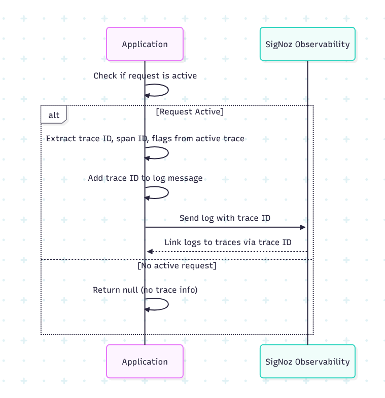
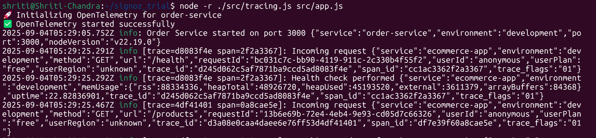
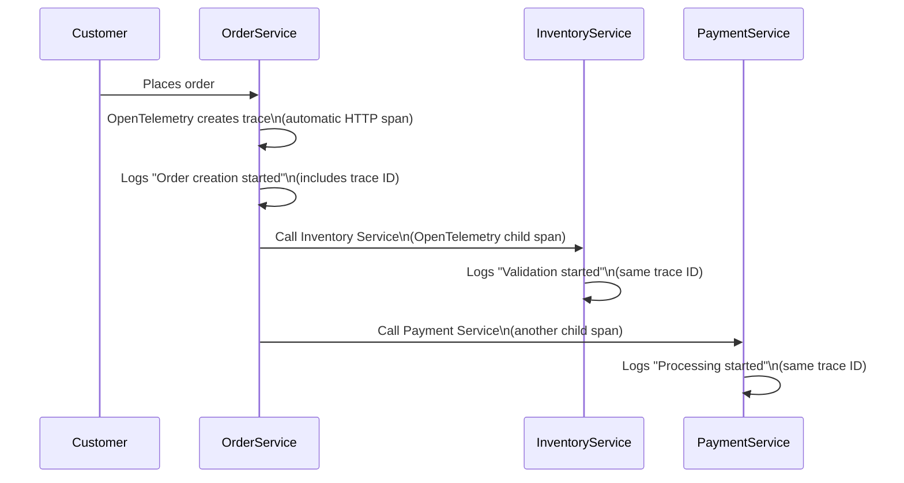

## SigNoz NodeJS Demo

### **Create a realistic e-commerce application** with - 

* 3 microservices: Order, Payment, and Inventory services
* Automatic trace generation using OpenTelemetry
* Winston logging with trace context injection
* SigNoz integration for observability

#### **Under the Hood** 

* **OpenTelemetry does the heavy lifting** - Automatically creates traces for HTTP calls
* **Custom logger formatter** - Adds trace IDs to every log message  
* **Span attributes** - Used to add business context to traces for better filtering
* **Consistent headers** - Passes context between services
* **SigNoz connects everything** - Links traces and logs automatically


  
### Prerequisites

    Docker and Docker Compose
    Git
    4GB+ RAM
    Ports 3000, 3301, 4317, 9000 free

### Setup

1. Clone the project -

```bash
git clone https://github.com/chandrashritii/signoz_trial_app
cd signoz_trial_app
```

2. Kickstart your docker containers - 

```bash
docker compose up -d
```

Note - Wait for all services to start (this takes 2-3 minutes).

3. Verify SigNoz is running: Open http://localhost:3301

4. Spin up your node js app - 

```bash
# Spin up three terminals in parallel and run the following
# Terminal 1: Start Order Service
npm run start

# Terminal 2: Start Payment Service  
npm run start:payment

# Terminal 3: Start Inventory Service
npm run start:inventory
```
You should be able to observe an output like this - 


Notice how the console logs now show trace context!

### **Testing and Sample data generation** - 

We’ve added some testing scripts in the demo-app to generate data and help you test the app. This includes - 

1. api_testing.sh - Checks and validates that all your endpoints are running
2. demo_scenarios.sh - Runs a few demo scenarios to validate all flows and generate data
3. generate_load.sh - Run for load testing in parallel

Read more - https://docs.google.com/document/d/1sKSti3GPXiQVZnRIADe9jt_XMgor4FW9noNZKdE4e1I/edit?tab=t.0#bookmark=id.8995yc69pc7g

**App workflow** -




Developer Notes -

We are doing a local setup for signoz here. If you want to set this up with SigNoz cloud, you’ll need to swap out your .env config for OTEL_EXPORTER with -

```bash
SIGNOZ_ACCESS_TOKEN={your access token}
OTEL_EXPORTER_OTLP_TRACES_ENDPOINT=https://ingest.{region}.signoz.cloud:443/v1/traces
OTEL_EXPORTER_OTLP_METRICS_ENDPOINT=https://ingest.{region}.signoz.cloud:443/v1/metrics
```


